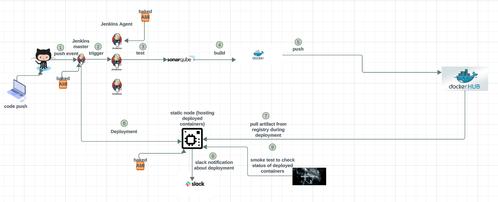

# weather-app-project
weather-app-project

1. Request the code URL from version control: Ask the development team for the code URL.
2. Ask the developer for any extra specifications: Consult the development team for additional specifications.
3. Determine the number of services (UI, weather, auth, redis, db): Confirm with the development team that there are five services.
4. Determine the number of services developed by your company (UI, weather, auth): Confirm with the development team that your company has developed three services.
5. Determine the number of third-party services not developed by your company (redis, db): Confirm with the development team that there are two third-party services.
6. Ensure you have all Dockerfiles for services developed by your company: Verify that Dockerfiles for UI, weather, and auth services are available.
7. Write Dockerfiles for third-party services not developed by your company: Create Dockerfiles for redis and db.
8. Determine the deployment strategy with the DevOps team: Collaborate with the DevOps team to choose Docker-compose as the deployment strategy.
9. Verify the availability of all required files for the deployment strategy.
10. Manage secrets: Identify three secrets and plan to manage them using Jenkins secret store.
11. Determine deployment stages:

    - **Write Jenkinsfile:**
        - Clone the code: Set up a webhook for code cloning.
        - Check important files: Ensure the presence of the required SonarQube property file.
        - Build code binary if required: Specify the language (Node, Go, Python) for building.
    
    - **Code scanning:**
        - Scan the code using sonar-scanner: Configure sonar-scanner connections between Jenkins and SonarQube.
        - Report to SonarQube UI: Establish connections between SonarQube, Jenkins, and the UI for reporting.
    
    - **Code quality:**
        - Check quality gate:
            - If the code passes, continue with the build: Incorporate the quality gate in the Jenkinsfile.
            - If the code fails, stop the build.
    
    - **If code quality passes:**
        - Build Docker images: Build images using Docker for all branches.
        - Push Docker images to DockerHub:
            - If the commit branch is not 'develop', do not push (not a pull request).
            - If the commit branch is 'develop', push to DockerHub (if it is a pull request).
    
        - **If the commit branch is 'develop' (pull request):**
            - Deploy the application:
                - Construct the Docker-compose: Write the Docker-compose file.
                - Deploy to a VM: Use Jenkins to launch the VM.
    
    - **Smoke check:**
        - Smoke check the application after deployment: Query the application header.
    
    - **Post-build:**
        - Notify DevOps team on build output on Slack: Use Jenkins to notify the DevOps team on Slack and end-user.

12. Create the Jenkins project.
13. Establish all required connections, including plugins.
14. Implement the project in Jenkins.

